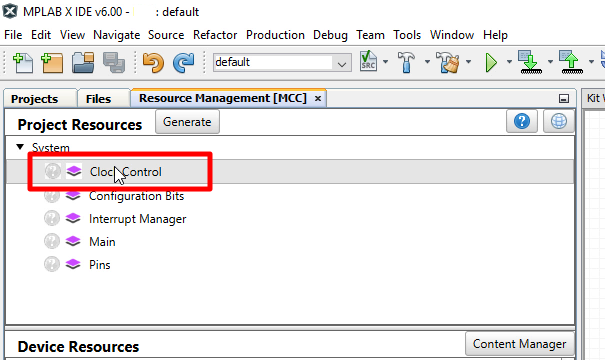
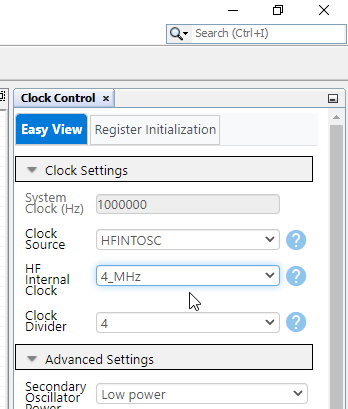
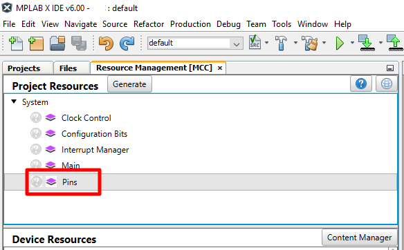
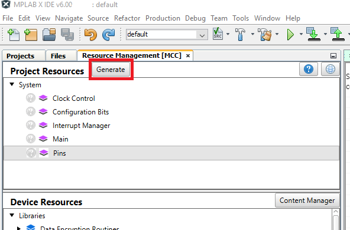
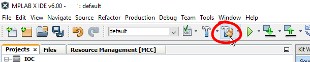
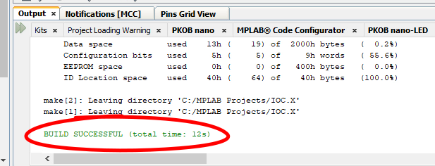
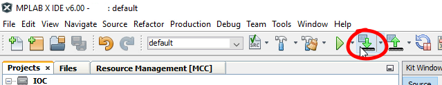
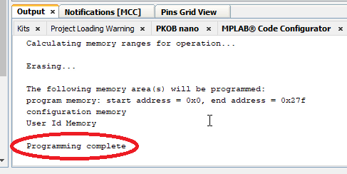
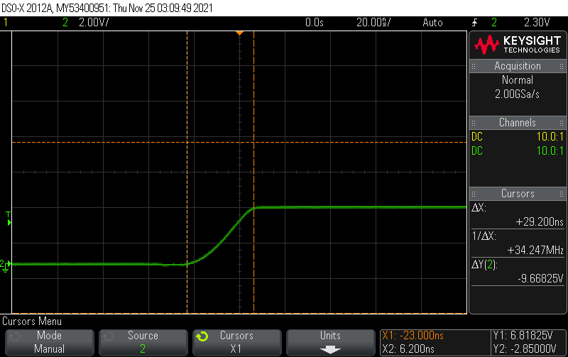
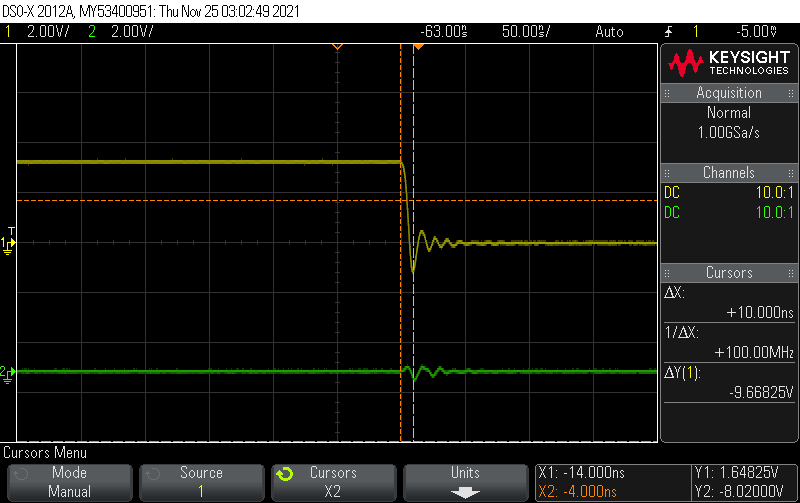

<!-- Please do not change this logo with link -->

[](https://www.microchip.com)

# Slew Control Feature of the GPIO Module

This code example shows Slew Control feature of the GPIO module.

## Related Documentation

- [MPLAB Code Configurator](https://www.microchip.com/en-us/development-tools-tools-and-software/embedded-software-center/mplab-code-configurator)
- [PIC18-Q43 Family Product Page](https://www.microchip.com/en-us/products/microcontrollers-and-microprocessors/8-bit-mcus/pic-mcus/pic18-q43)
## Software Used


- MPLAB® X IDE 6.0.0 or newer [(MPLAB® X IDE 6.0)](https://www.microchip.com/en-us/development-tools-tools-and-software/mplab-x-ide?utm_source=GitHub&utm_medium=TextLink&utm_campaign=MCU8_MMTCha_MPAE_Examples&utm_content=pic18f57q43-cnano-slew-control-mplab-melody-github)
- MPLAB® XC8 2.35.0 or newer compiler [(MPLAB® XC8 2.35)](https://www.microchip.com/en-us/development-tools-tools-and-software/mplab-xc-compilers?utm_source=GitHub&utm_medium=TextLink&utm_campaign=MCU8_MMTCha_MPAE_Examples&utm_content=pic18f57q43-cnano-slew-control-mplab-melody-github)
- MPLAB® Code Configurator (MCC) 5.1.0 or newer [(microchip.com/mplab/mplab-code-configurator)](https://www.microchip.com/mplab/mplab-code-configurator)
- MPLAB® Code Configurator (MCC) Melody 2.0.46 or newer [(microchip.com/en-us/tools-resources/configure/mplab-code-configurator/melody)](https://www.microchip.com/en-us/tools-resources/configure/mplab-code-configurator/melody)
- Microchip PIC18F-Q Series Device Support (1.13.211) or newer [(packs.download.microchip.com/)](https://packs.download.microchip.com/)

## Hardware Used

- [Microchip PIC18F57Q43 Curiosity Nano Evaluation Kit](https://www.microchip.com/developmenttools/ProductDetails/DM164150)
- [Microchip Curiosity Nano Base for Click boards](https://www.microchip.com/developmenttools/ProductDetails/AC164162)
- [Breadboard](https://www.mouser.com/ProductDetail/426-FIT0008)
- [Switches](https://www.mouser.com/ProductDetail/506-FSM2JRT)
- [LED](https://www.mouser.com/ProductDetail/941-C5SMFRJECT0W0BB2)
- [Resistor](https://www.mouser.com/ProductDetail/603-CFR-25JB-52-330R)
- [Wire Kit](https://www.mouser.com/ProductDetail/424-WIRE-KIT)

### Hardware User Guide
</a>

This example code will demonstrate how to set up the GPIO using Limited Slew Rate feature on one pin and the Maximum Slew Rate feature on another pin using PIC18F57Q43 Nano Development board. This hardware setup is used in the GPIO Microchip University class, however this example does not use the switches or the LEDs. This example can be reproduced using just the PIC18F57Q43 Nano Development and an oscilloscope to view and capture the resulting waveforms.

## Setup

The first step to setup the hardware for this example is to connect the PIC18F57Q43 Curiosity Nano board to the PC.

Next, connect pin RB0 and pin RC0 directly to two separate channels of an oscilloscope.

MCC with the Melody library was used to implement this example as shown in the following section.
## Clock Control Configuration
In the Project Resources window select "Clock Control" as shown in the figure below.



After selecting the "Clock Control" option, a window on the right side of the MPLAB-IDE will appear called *Clock Control Easy View*. Use the Dropdown boxes to select HFINTOSC, 4MHz, and divide by 4 as shown in the figure below.



## Pin Configuration
```suggestion
In the *Pins Grid View* find RB0, RB4, RC0 and RC4 for the Output pins. Select by clicking the corresponding padlock symbol as shown in the figure below. Next, find pin RA5 for LED1, and pin RF3 for LED0 and configure them by clicking the corresponding padlock symbol as shown in the figure below.

**Pins Grid View**


## Pin Control Configuration
In the *Project Resources* window select the "Pins" option.



After selecting the "Pins" option, a window on the right side of the MPLAB-IDE will appear called "Pins". Slide the bar on the left side to view more of the window.
De-select the "Analog" checkbox on all pins in this window to disable analog functionality, which is not needed for this example. 


Use the "Custom Name" field to rename IO_RB0 to RB0, IO_RB4 to RB4, IO_RC0 to RC0 and IO_RC4 to RC4.


## Slew Control Configuration
Click the "Slew Rate" checkbox for RC0 and RC4 to configure the maximum slew rate on these pins. 


In the *Project Resources* window click the "Generate" button.



Once the code has been generated by Melody, select the "Clean and Build" button.



Once the project has been successfully built the output window should show the following message:



Copy this code into the main loop of main.c


        RB0_Toggle();
        if(RB0_LAT == 0) RB4_LAT = 0;
        if(RB0_LAT == 1) RB4_LAT = 1;
        RC0_Toggle();
        if(RC0_LAT == 0) RC4_LAT = 0;
        if(RC0_LAT == 1) RC4_LAT = 1;


Click the "Clean and Build" button once the routine has been copied into the main loop.


Once the project has been successfully built the output window should show the following message:


Click the "Program Device" button.



Once the device has been successfully programmed, the output window should show the following message:


## Operation

If you have an oscilloscope handy you can do the same but I will show the scope plots so you can see visually what to look for.
The first scope signal is the signal on RB0 this shows the signal and how long it takes to change state it shows 29 ns. The second scope signal is on RC0 and it shows about 10 ns there’s a little bit of ringing in the signal but it still changes faster than the pin with limited slew rate control.

Limited Slew



Maximum Slew



## Summary

The example has shown how Melody can be used to easily configure pins, using the Slew Control feature of the GPIO module module of the PIC18F57Q43 device.