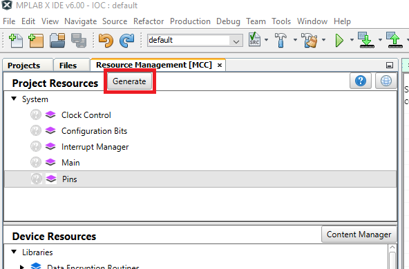

<!-- Please do not change this logo with link -->

# Slew Control Feature of the GPIO Module

<!-- This is where the introduction to the example goes, including mentioning the peripherals used -->

## Related Documentation

<!-- Any information about an application note or tech brief can be linked here. Use unbreakable links!
     In addition a link to the device family landing page and relevant peripheral pages as well:
     - [AN3381 - Brushless DC Fan Speed Control Using Temperature Input and Tachometer Feedback](https://microchip.com/00003381/)
     - [PIC18F-Q10 Family Product Page](https://www.microchip.com/design-centers/8-bit/pic-mcus/device-selection/pic18f-q10-product-family) -->
- [MPLAB Code Configurator](https://www.microchip.com/en-us/development-tools-tools-and-software/embedded-software-center/mplab-code-configurator)
- [PIC18-Q43 Family Product Page](https://www.microchip.com/en-us/products/microcontrollers-and-microprocessors/8-bit-mcus/pic-mcus/pic18-q43)
## Software Used

<!-- All software used in this example must be listed here. Use unbreakable links!
     - MPLAB® X IDE 5.30 or newer [(microchip.com/mplab/mplab-x-ide)](http://www.microchip.com/mplab/mplab-x-ide)
     - MPLAB® XC8 2.10 or a newer compiler [(microchip.com/mplab/compilers)](http://www.microchip.com/mplab/compilers)
     - MPLAB® Code Configurator (MCC) 3.95.0 or newer [(microchip.com/mplab/mplab-code-configurator)](https://www.microchip.com/mplab/mplab-code-configurator)
     - MPLAB® Code Configurator (MCC) Device Libraries PIC10 / PIC12 / PIC16 / PIC18 MCUs [(microchip.com/mplab/mplab-code-configurator)](https://www.microchip.com/mplab/mplab-code-configurator)
     - Microchip PIC18F-Q Series Device Support (1.4.109) or newer [(packs.download.microchip.com/)](https://packs.download.microchip.com/) -->

- MPLAB® X IDE 6.0.0 or newer [(MPLAB® X IDE 6.0)](https://www.microchip.com/en-us/development-tools-tools-and-software/mplab-x-ide?utm_source=GitHub&utm_medium=TextLink&utm_campaign=MCU8_MMTCha_MPAE_Examples&utm_content=pic18f57q43-cnano-slew-control-mplab-melody-github)
- MPLAB® XC8 2.35.0 or newer compiler [(MPLAB® XC8 2.35)](https://www.microchip.com/en-us/development-tools-tools-and-software/mplab-xc-compilers?utm_source=GitHub&utm_medium=TextLink&utm_campaign=MCU8_MMTCha_MPAE_Examples&utm_content=pic18f57q43-cnano-slew-control-mplab-melody-github)

## Hardware Used

<!-- All hardware used in this example must be listed here. Use unbreakable links!
     - PIC18F47Q10 Curiosity Nano [(DM182029)](https://www.microchip.com/Developmenttools/ProductDetails/DM182029)
     - Curiosity Nano Base for Click boards™ [(AC164162)](https://www.microchip.com/Developmenttools/ProductDetails/AC164162)
     - POT Click board™ [(MIKROE-3402)](https://www.mikroe.com/pot-click) -->
- [Microchip PIC18F57Q43 Curiosity Nano Evaluation Kit](https://www.microchip.com/developmenttools/ProductDetails/DM164150)
- [Microchiop Curiosity Nano Base for Click boards](https://www.microchip.com/developmenttools/ProductDetails/AC164162)

</a>
### Hardware User Guide

This example code will show you how to set up the GPIO using Limited Slew on one Port and Maximum Slew on the other.  using the  PIC18F57Q43 curiosity nano.

## Setup

<!-- Explain how to connect hardware and set up software. Depending on complexity, step-by-step instructions and/or tables and/or images can be used -->
MCC with the Melody library was used to implement this example as shown in the following section.
## Clock Control Configuration
In the *Project Resources* window click Clock Control. 

A window on the right side of the MPLAB-IDE will appear called *Clock Control Easy View* use the Dropdown boxes to select HFINTOSC, 4MHz, and devide by 4.

## Pin Configuration
In the *Pins Grid View* find RB0, RB4, RC0 and RC4 for the Output pins. Select by clicking the corresponding padlock symbol. find RA5 for LED1, and RF3 for LED0 for imput selection by clicking the corresponding padlock symbol

**Pins Grid View**

## Pin Control Configuration
In the *Project Resources* window click Pins. 

A window on the right side of the MPLAB-IDE will appear called pins slide the bar on the left side to view more of the window.
De-select analog on all pins. 

Rename IO_RB0 to RB0, IO_RB4 to RB4, IO_RC0 to RC0 and IO_RC4 to RC4. 

## Slew Control Configuration
Click the Slew checkbox for RC0 and RC4 to make them Maximum slew. 

In the *Project Resources* window click Generate.

Click Clean and Build button.

Success!!

Copy this code into the main loop of main.c

        RB0_Toggle();
        if(RB0_LAT == 0) RB4_LAT = 0;
        if(RB0_LAT == 1) RB4_LAT = 1;
        RC0_Toggle();
        if(RC0_LAT == 0) RC4_LAT = 0;
        if(RC0_LAT == 1) RC4_LAT = 1;

Click Clean and Build button.

Success!!

Click Program Device button.

Success!!

## Operation

<!-- Explain how to operate the example. Depending on complexity, step-by-step instructions and/or tables and/or images can be used -->
If you have an oscilloscope handy you can do the same but I will show the scope plots so you can see visually what to look for.
The first scope signal is the signal on RB0 this shows the signal and how long it takes to change state it shows 29 ns. The second scope signal is on RC0 and it shows about 10 ns there’s a little bit of ringing in the signal but it still changes faster than the pin with limited slew rate control.

Limited Slew

Maximum Slew

## Summary

<!-- Summarize what the example has shown -->
The example has shown how Melody can be used to easily configure pins, using the Slew Control feature of the GPIO module module of the PIC18F57Q43 device.